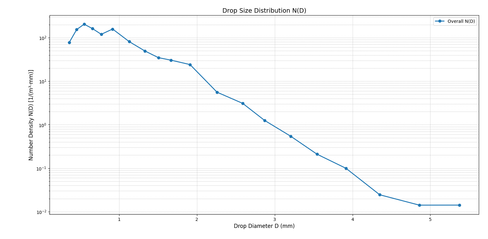
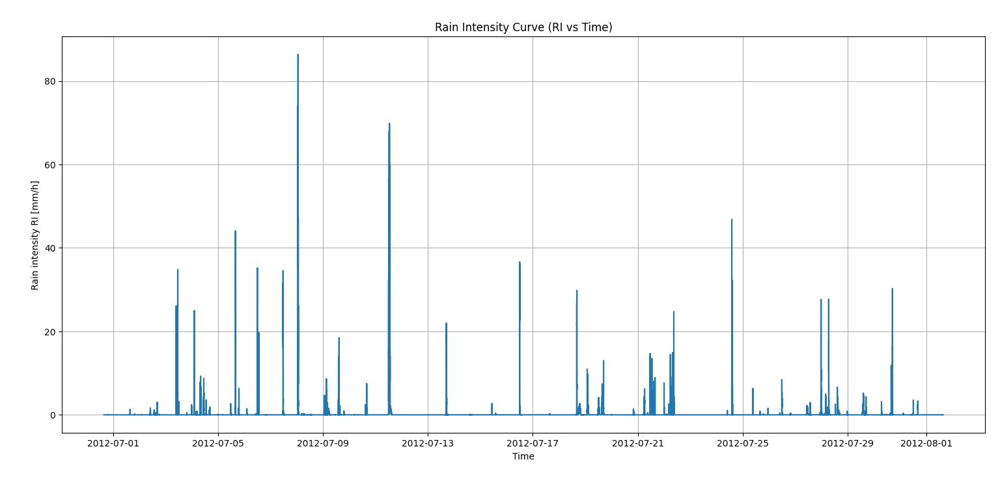

# Rain Drop Size Distribution Analysis at a Tropical Region  
### **Final Year Project (B.Tech – Electronics & Communication Engineering)**  
### **Using Python & RD-80 Disdrometer Data**

---

## Project Overview

This final year project focuses on analysing **Rain Drop Size Distribution (DSD)** in a tropical region using real-world data from an **RD-80 Optical Disdrometer**. The goal is to understand rainfall microphysics, compute physical rainfall parameters, and compare instrument-measured values with theoretical calculations using Python.

This analysis is scientifically valuable for:
- Weather prediction  
- Hydrological modelling  
- Radar calibration  
- Tropical climate rainfall research  

---

##  Objectives

- Process raw RD disdrometer files (`RD-*.txt` → `.csv`)
- Compute rainfall parameters using RD-80 formulas
- Compare **Computed RI** vs **Instrument RI**
- Generate DSD curves and rainfall intensity patterns
- Filter faulty (zero-drop) intervals
- Study tropical rainfall characteristics through DSD

---

##  Dataset Description

The dataset consists of multiple files recorded by an **RD-80 Laser Disdrometer**, containing:

- 20 drop-size class counts (n1…n20)
- Average diameter per class (Di)
- Fall velocities v(Di)
- Diameter bin width ΔDi
- Rainfall intensity (RI)
- Rain amount (RA)
- Accumulated rainfall (RAT)
- Time stamp (date + time)
- Sampling interval (t = 30 seconds)

The optical sensor detects drops passing through a laser beam, classifies them into size bins, and estimates rainfall intensity.

---

##  Methodology

### **Preprocessing**
- Convert TXT to CSV  
- Merge all RD files  
- Create timestamp column  
- Remove rows with `n1–n20 = 0` (no rain detected)

### **Computing Parameters**

### **Rainfall Intensity (Formula-based)**  
$$
RI = \frac{\pi}{6} \cdot \frac{3.6 \times 10^3}{F \cdot t} \sum_{i=1}^{20} n_i D_i^3
$$


### **Drop Size Distribution N(D)**  
$$
N(D_i) = \frac{n_i}{F \cdot t \cdot v(D_i) \cdot \Delta D_i}
$$

### **Comparison**
- Plot **RI (instrument)** vs **RI (formula-based)**
- Use log scale for meaningful comparison
- Identify scaling differences and rain event patterns

---

## Results & Observations

- Instrument-measured RI ranges from **0.01 to ~100 mm/h**
- Formula-based RI shows scaling differences due to unit mismatches
- After filtering zero-drop intervals, both curves align in temporal structure
- DSD curves show typical tropical rain behaviour with high concentration of small drops
- The dataset includes both rain and non-rain intervals → filtering is essential

---

## Tech Stack

| Component | Technology |
|----------|------------|
| Programming | Python 3 |
| Libraries | NumPy, Pandas, Matplotlib |
| Tools | Jupyter Notebook / VS Code |
| Hardware | RD-80 Optical Disdrometer |

---

## Repository Structure

```
├── data/
│   ├── RD-*.txt
│   ├── RD-*.csv
├── scripts/
│   ├── convert_txt_to_csv.py
│   ├── rainfall_intensity_comparison.py
│   ├── dsd_distribution_plot.py
├── plots/
│   ├── DistributionCurve.png
│   ├── RainIntensityCurve.png
└── README.md
```

---

## Visualizations  




```

---

## Authors

**Manishita Biswas**  
**Anik Khajanchi**  

B.Tech – Electronics & Communication Engineering  
University of Calcutta  

If you found this useful, feel free to ⭐ the repository!

---

